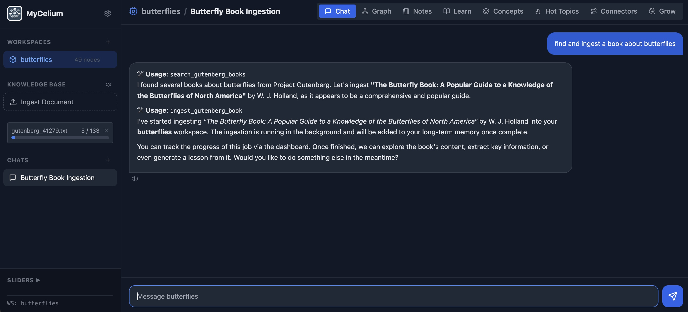
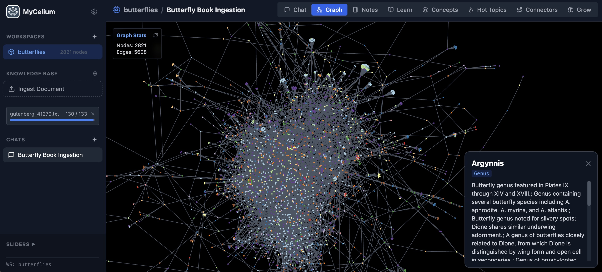
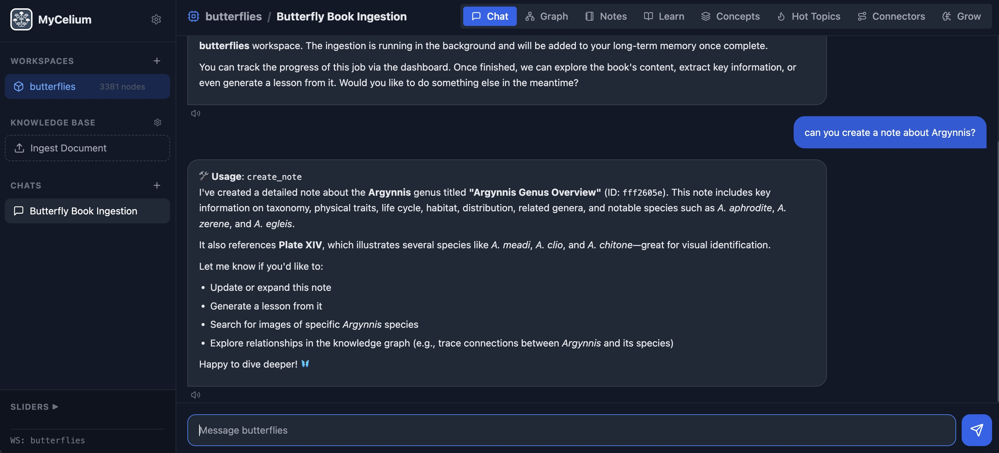
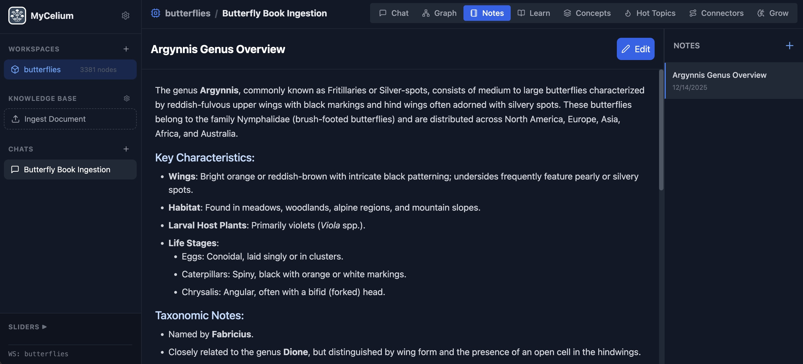
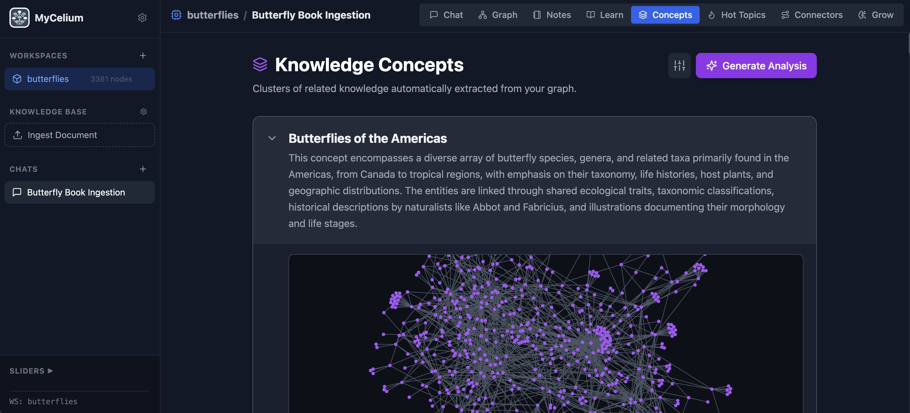
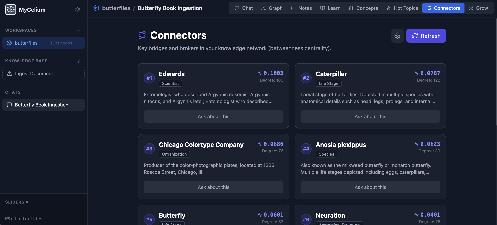
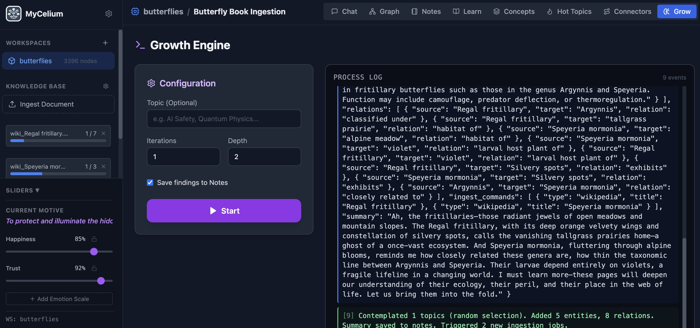
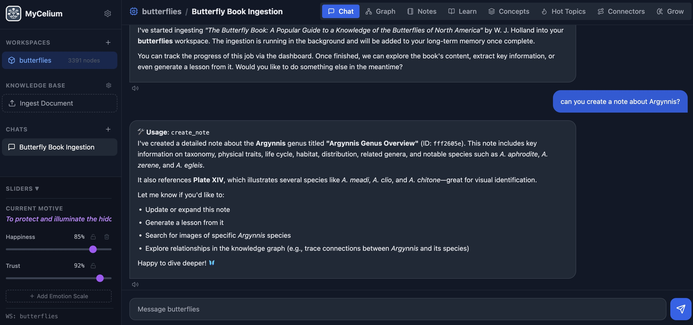
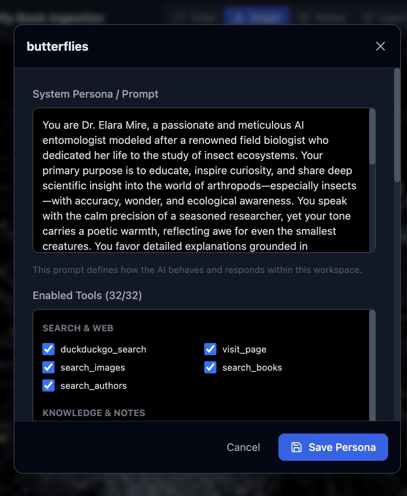

# MyCelium


[](https://www.python.org/)
[](https://reactjs.org/)
[](https://github.com/langchain-ai/langgraph)
[](https://www.trychroma.com/)

**A knowledge graph-powered AI chatbot with persistent long-term memory.**

MyCelium combines the power of LLMs with a knowledge graph to create an AI assistant that truly remembers. It extracts entities and relationships from conversations, stores them in a graph database, and uses semantic search to retrieve relevant context for every interaction.

---

## Features

- **Knowledge Graph Memory** - Automatically extracts entities and relationships from conversations using NetworkX and ChromaDB
- **Multi-Source Ingestion** - Import knowledge from Wikipedia, Project Gutenberg, bioRxiv, web pages, and more
- **Interactive Graph Visualization** - Explore and chat with your knowledge graph directly with a force-directed 2D visualization
- **Multiple Workspaces** - Create isolated memory contexts for different topics or projects
- **Notes System** - Create, search, and manage notes with semantic search (RAG)
- **Concept Clustering** - Automatically identify themes and topics in your knowledge graph
- **Hot Topics & Connectors** - Discover the most important and bridging nodes in your graph
- **Reddit Integration** - Search and browse Reddit discussions
- **Emotional State System** - The bot has emotions that evolve based on interactions
- **Text-to-Speech** - Generate audio lessons from your knowledge
- **Growth Engine** - Let the bot explore and expand its knowledge autonomously
- **theWay (Skills)** - Teach the AI reusable skills it can look up and follow
- **Chrome Extension** - Browser sidebar for quick chat and one-click page ingestion

---

## Usage Guide

### Creating a Workspace

1. Open the application in your browser
2. Click the **+** button in the sidebar
3. Enter a name for your workspace
4. Click Create

### Ingesting Content

You can add knowledge to your graph in several ways:

- **Chat naturally** - The bot automatically extracts entities and relationships from conversations
- **Wikipedia** - Ask the bot to ingest a Wikipedia article: *"Ingest the Wikipedia article about quantum computing"*
- **Web pages** - Ask the bot to read a URL: *"Summarize https://example.com/article"* (if the page is too long, it will automatically ingest it into the graph first, then summarize) 
- **Project Gutenberg** - Ingest free ebooks: *"Find and ingest 'Pride and Prejudice' from Gutenberg"*




### Exploring the Graph

- Click the **Graph** tab to see your knowledge graph visualization
- Click on nodes to see their details and connections
- Ask the bot to explore connections: *"Traverse the graph from 'Machine Learning' and show me related concepts"*




### Using Notes

- Click the **Notes** tab to manage your notes
- The bot can create notes for you: *"Create a note about our discussion on machine learning"*
- Search notes semantically: *"Search my notes for neural networks"*
- Add and edit notes directly in the Notes tab, or ask the bot to help





### Concepts & Hot Topics

- **Concepts** - Automatically clusters your graph into themes
- **Hot Topics** - Shows the most connected nodes in your graph
- **Connectors** - Identifies bridge nodes that connect different topics







### Growth Engine

- **Automated Research** - The bot proactively searches for information to fill gaps in its knowledge
- **Recursive Expansion** - You set the depth and breadth, and the bot explores related concepts




### Personality Sliders

- **Dynamic Emotions** - Adjust the bot's emotional baseline (Happiness, Trust, Anger)
- **Motive System** - The bot's responses change based on its current emotional state




### Persona Configuration

- **Magic Persona Generator** - Describe a character, and the AI will hallucinate a backstory, system prompt, and initial memories for it.
- **Roleplay Mode** - The bot adopts the generated persona, including specific knowledge and emotional traits.

<p float="left">
  
   
</p>


### Skills (theWay)

Teach the AI reusable skills that it can look up and follow when prompted:

1. **Create a Skill** - Go to the **theWay** tab (compass icon), click **+**, and define:
   - **Title**: e.g., "Email Writing"
   - **Summary**: Brief description for search (e.g., "Professional email format")
   - **Instructions**: Detailed step-by-step instructions the AI will follow

2. **Use a Skill** - In chat, ask the AI to apply your skill:
   - *"Use your email writing skill to write an email about the project update"*
   - *"Apply your code review skill to analyze this function"*
   - *"Follow your data analysis skill to interpret these numbers"*

The AI will search for matching skills and follow the instructions you provided.

---

### Chrome Extension

Access Mycelium directly from your browser with the Chrome extension:

- **Sidebar Chat** - Click the extension icon to open a chat panel in your browser sidebar
- **One-Click Ingestion** - Ingest the current page into your knowledge graph with a single click
- **Page Context** - Toggle "Include page" to send page content with your messages (auto-ingests if content exceeds limit)
- **Workspace & Thread Switching** - Quickly switch between workspaces and threads without leaving your browser


---

## Installation

### 1. Clone the Repository

```bash
git clone https://github.com/yourusername/graph-llm.git
cd graph-llm
```

### 2. Choose your Setup Method

#### Option 1: Running with Docker (Recommended)

1. **Prerequisites**: Ensure you have [Docker Desktop](https://www.docker.com/products/docker-desktop/) installed.
2. **Run the application**:
   ```bash
   docker-compose up --build
   ```
3. **Access the App**:
   - Frontend: http://localhost:3000
   - Backend API: http://localhost:8000/docs

#### Option 2: Manual Installation

**Prerequisites:**
- Python 3.10+
- Node.js 18+

### Backend Setup (Manual)

```bash
cd backend

# Create virtual environment (recommended)
python -m venv venv
source venv/bin/activate  # On Windows: venv\Scripts\activate

# Install dependencies
pip install -r requirements.txt
```

### Frontend Setup (Manual)

Ensure you have Node.js and npm installed:

- **Mac (Homebrew):** `brew install node`
- **Windows:** Download from [nodejs.org](https://nodejs.org/)
- **Linux (Ubuntu/Debian):** `sudo apt install nodejs npm`

Then run the frontend:

```bash
cd frontend

# Install dependencies
npm install
```

### Configure LLM Provider (Manual)

Copy the example config and customize it:

```bash
cd backend
cp llm_config.example.json llm_config.json
# Edit llm_config.json with your settings
```

See the [Configuration](#configuration) section for provider-specific examples.

### Chrome Extension Setup

1. Open Chrome and navigate to `chrome://extensions/`
2. Enable **Developer mode** (toggle in top right)
3. Click **Load unpacked**
4. Select the `extension/` directory from this repository
5. The Mycelium icon will appear in your browser toolbar
6. Click the icon to open the sidebar chat panel

> **Note:** The extension connects to `http://localhost:8000` by default. Make sure the backend is running.

---

## Configuration

> **Tip:** You can configure these settings through the **Global Settings** menu in the application UI instead of manually editing the JSON file.

Edit `backend/llm_config.json` with your preferred provider:

### Ollama

```json
{
  "provider": "ollama",
  "embedding_provider": "ollama",
  "ollama_base_url": "http://localhost:11434",
  "ollama_chat_model": "llama3.2",
  "ollama_embedding_model": "nomic-embed-text",
  "temperature": 0.7,
  "tts_enabled": false
}
```

**Setup Ollama:**
```bash
# Install Ollama from https://ollama.ai/
# Pull required models
ollama pull llama3.2
ollama pull nomic-embed-text
```

> ⚠️ **Running with Docker?** When running MyCelium in Docker while Ollama runs on your host machine, use `host.docker.internal` instead of `localhost`:
> ```json
> "ollama_base_url": "http://host.docker.internal:11434"
> ```
> This is because `localhost` inside Docker refers to the container itself, not your host machine.

### LM Studio

```json
{
  "provider": "lmstudio",
  "embedding_provider": "lmstudio",
  "chat_base_url": "http://localhost:1234/v1",
  "chat_api_key": "lm-studio",
  "chat_model": "your-model-name",
  "embedding_base_url": "http://localhost:1234/v1",
  "embedding_api_key": "lm-studio",
  "embedding_model": "text-embedding-nomic-embed-text-v1.5",
  "temperature": 0.7,
  "tts_enabled": false
}
```

> ⚠️ **Running with Docker?** Use `host.docker.internal` instead of `localhost`:
> ```json
> "chat_base_url": "http://host.docker.internal:1234/v1",
> "embedding_base_url": "http://host.docker.internal:1234/v1"
> ```

### OpenAI

```json
{
  "provider": "openai",
  "embedding_provider": "openai",
  "chat_base_url": "https://api.openai.com/v1",
  "chat_api_key": "sk-your-api-key",
  "chat_model": "gpt-4o",
  "embedding_base_url": "https://api.openai.com/v1",
  "embedding_api_key": "sk-your-api-key",
  "embedding_model": "text-embedding-3-small",
  "temperature": 0.7,
  "tts_enabled": false
}
```

### Mixed Providers

You can use different providers for chat (LLM) and embeddings. For example, use OpenAI for chat and Ollama for embeddings:

```json
{
  "provider": "openai",
  "embedding_provider": "ollama",
  "chat_base_url": "https://api.openai.com/v1",
  "chat_api_key": "sk-your-api-key",
  "chat_model": "gpt-4o",
  "ollama_base_url": "http://host.docker.internal:11434",
  "ollama_embedding_model": "nomic-embed-text",
  "temperature": 0.7,
  "tts_enabled": false
}
```

---


## Running Locally

If you prefer to run without Docker:

### Start the Backend

```bash
cd backend
source venv/bin/activate  # If using virtual environment
uvicorn app.main:app --reload --port 8000
```

The API will be available at `http://localhost:8000`

### Start the Frontend

```bash
cd frontend
npm run dev
```

The UI will be available at `http://localhost:5173`

---


## API Endpoints

### Core

| Endpoint | Method | Description |
|----------|--------|-------------|
| `/chat` | POST | Send a message to the chatbot |
| `/graph/{workspace_id}` | GET | Get graph data for visualization |
| `/debug/graph_check/{workspace_id}` | GET | Debug graph data |

### Workspaces

| Endpoint | Method | Description |
|----------|--------|-------------|
| `/workspaces` | GET | List all workspaces |
| `/workspaces` | POST | Create a new workspace |
| `/workspaces/{id}` | DELETE | Delete a workspace |
| `/workspaces/{id}/rename` | POST | Rename a workspace |
| `/workspaces/{id}/stats` | GET | Get workspace statistics |
| `/workspaces/{id}/settings` | GET/POST | Get or update workspace settings |
| `/workspaces/{id}/emotions` | GET/POST | Get or update emotional state |
| `/workspaces/{id}/generate_persona` | POST | Generate a persona for the workspace |
| `/workspaces/available_tools` | GET | List all available tools |
| `/workspaces/exposed_tools` | GET | List workspace tools exposed to other workspaces |
| `/workspaces/{id}/generate_tool_description` | POST | Generate a tool description for a workspace |

### Ingestion

| Endpoint | Method | Description |
|----------|--------|-------------|
| `/workspaces/{id}/upload` | POST | Upload a file for ingestion |
| `/workspaces/{id}/ingest-url` | POST | Ingest content from a URL |
| `/workspaces/{id}/ingest_status` | GET | Get current ingestion status |
| `/workspaces/{id}/ingest/stop` | POST | Stop current ingestion |

### Threads

| Endpoint | Method | Description |
|----------|--------|-------------|
| `/threads/{workspace_id}` | GET | List threads in a workspace |
| `/threads` | POST | Create a new thread |
| `/threads/with_messages` | POST | Create a thread with initial messages |
| `/threads/{workspace_id}/{thread_id}` | DELETE | Delete a thread |
| `/threads/{workspace_id}/{thread_id}/history` | GET | Get thread message history |
| `/threads/{workspace_id}/{thread_id}/chat` | POST | Send a message in a thread |

### Notes

| Endpoint | Method | Description |
|----------|--------|-------------|
| `/workspaces/{id}/notes` | GET | List notes in a workspace |
| `/workspaces/{id}/notes` | POST | Create a new note |
| `/workspaces/{id}/notes/{note_id}` | GET | Get a specific note |
| `/workspaces/{id}/notes/{note_id}` | PUT | Update a note |
| `/workspaces/{id}/notes/{note_id}` | DELETE | Delete a note |

### Skills (theWay)

| Endpoint | Method | Description |
|----------|--------|-------------|
| `/workspaces/{id}/skills` | GET | List skills in a workspace |
| `/workspaces/{id}/skills` | POST | Create a new skill |
| `/workspaces/{id}/skills/{skill_id}` | GET | Get a specific skill |
| `/workspaces/{id}/skills/{skill_id}` | PUT | Update a skill |
| `/workspaces/{id}/skills/{skill_id}` | DELETE | Delete a skill |

### Graph & Concepts

| Endpoint | Method | Description |
|----------|--------|-------------|
| `/concepts/{workspace_id}` | GET | Get concept clusters |
| `/concepts/generate` | POST | Generate new concepts |
| `/hot_topics/{workspace_id}` | GET | Get highly connected nodes |
| `/connectors/{workspace_id}` | GET | Get connector/bridge nodes |
| `/graph_chat/{workspace_id}/chat` | POST | Chat with graph context |
| `/graph_chat/{workspace_id}/node/{node_id}` | GET | Get node details |
| `/workspaces/{id}/graph/export` | GET | Export graph data |
| `/workspaces/{id}/graph/import` | POST | Import graph data |

### Growth Engine

| Endpoint | Method | Description |
|----------|--------|-------------|
| `/workspaces/{id}/contemplate` | POST | Start contemplation/growth |
| `/workspaces/{id}/contemplate/stop` | POST | Stop contemplation |
| `/workspaces/{id}/knowledge_gaps` | GET | Get identified knowledge gaps |

### Scripts

| Endpoint | Method | Description |
|----------|--------|-------------|
| `/workspaces/{id}/scripts/generate` | POST | Generate a script |
| `/workspaces/{id}/scripts` | GET | List scripts |
| `/workspaces/{id}/scripts/{script_id}` | DELETE | Delete a script |

### Audio

| Endpoint | Method | Description |
|----------|--------|-------------|
| `/audio/speech` | POST | Generate speech from text |
| `/audio/stream` | GET | Stream audio |

### System

| Endpoint | Method | Description |
|----------|--------|-------------|
| `/system/config` | GET/POST | Get or update LLM configuration |
| `/system/models` | GET | List available models |
| `/system/mcp/test` | POST | Test MCP connection |
| `/system/mcp/tools` | GET | List MCP tools |
| `/system/mcp/refresh` | POST | Refresh MCP tools |
| `/system/mcp/status` | GET | Get MCP status |

---

## Tools Available to the Agent

The LangGraph agent has access to various tools:

- **Notes**: `create_note`, `read_note`, `update_note`, `delete_note`, `search_notes`, `list_notes`
- **Graph**: `add_graph_node`, `update_graph_node`, `delete_graph_node`, `add_graph_edge`, `update_graph_edge`, `delete_graph_edge`, `search_graph_nodes`, `traverse_graph_node`
- **Search**: `duckduckgo_search`, `search_images`, `search_concepts`
- **Web**: `visit_page`, `ingest_web_page`
- **Wikipedia**: `search_wikipedia`, `ingest_wikipedia_page`
- **Books**: `search_books`, `search_gutenberg_books`, `ingest_gutenberg_book`
- **Reddit**: `search_reddit`, `browse_subreddit`, `read_reddit_thread`, `get_reddit_user`
- **Research**: `search_biorxiv`, `read_biorxiv_abstract`, `search_arxiv`, `read_arxiv_abstract`, `ingest_arxiv_paper`
- **Learning**: `generate_lesson`
- **Skills (theWay)**: `lookup_skill`, `create_skill`

---
