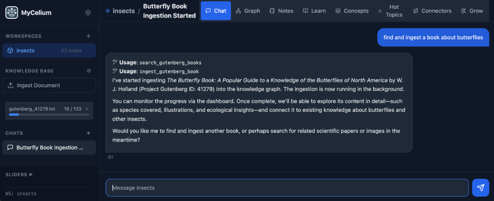
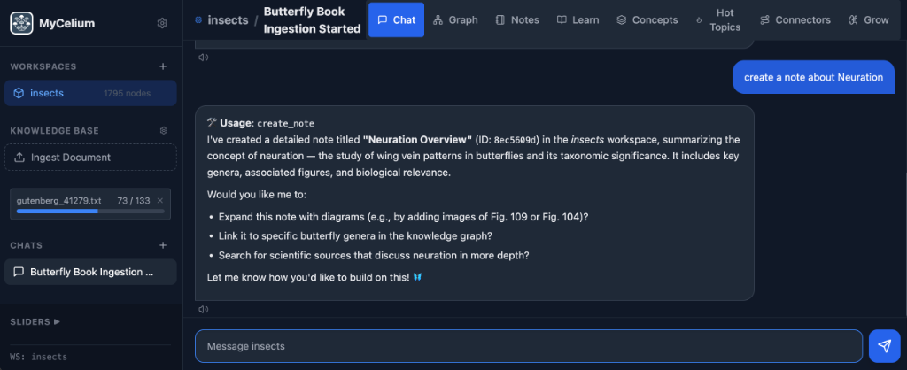
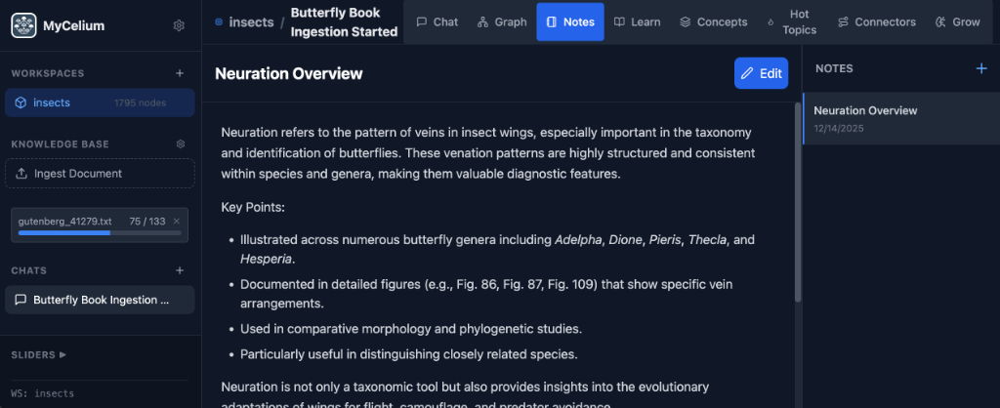
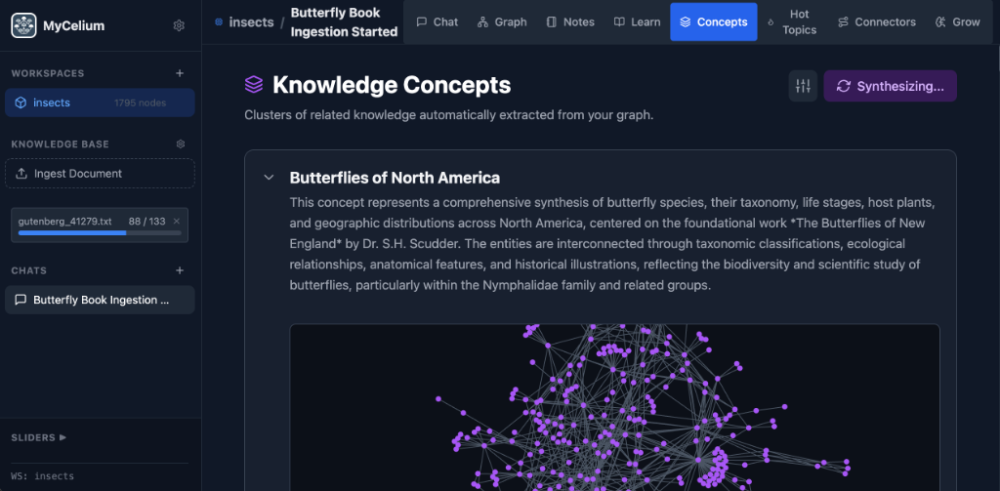
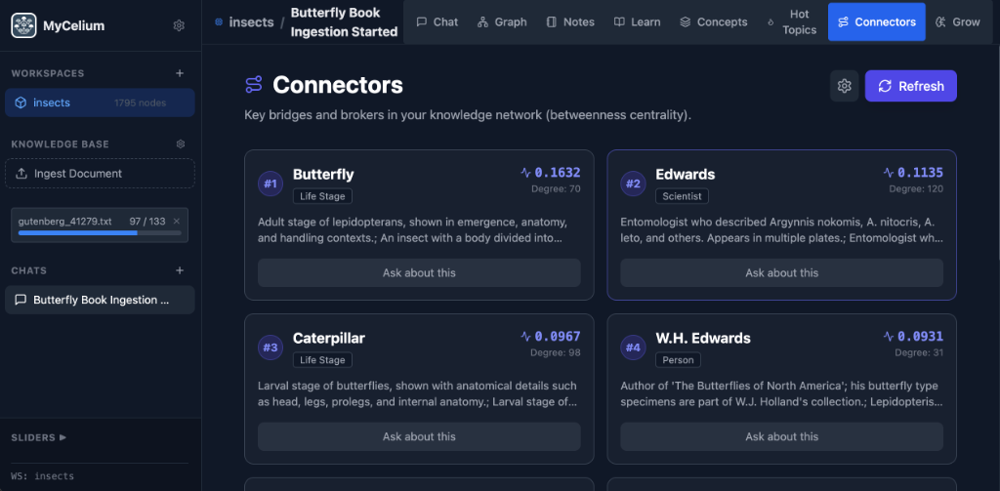
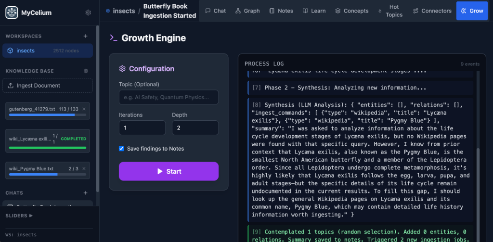
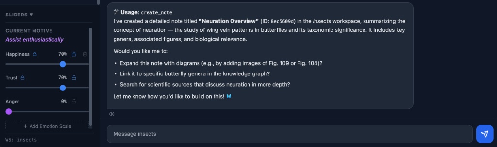
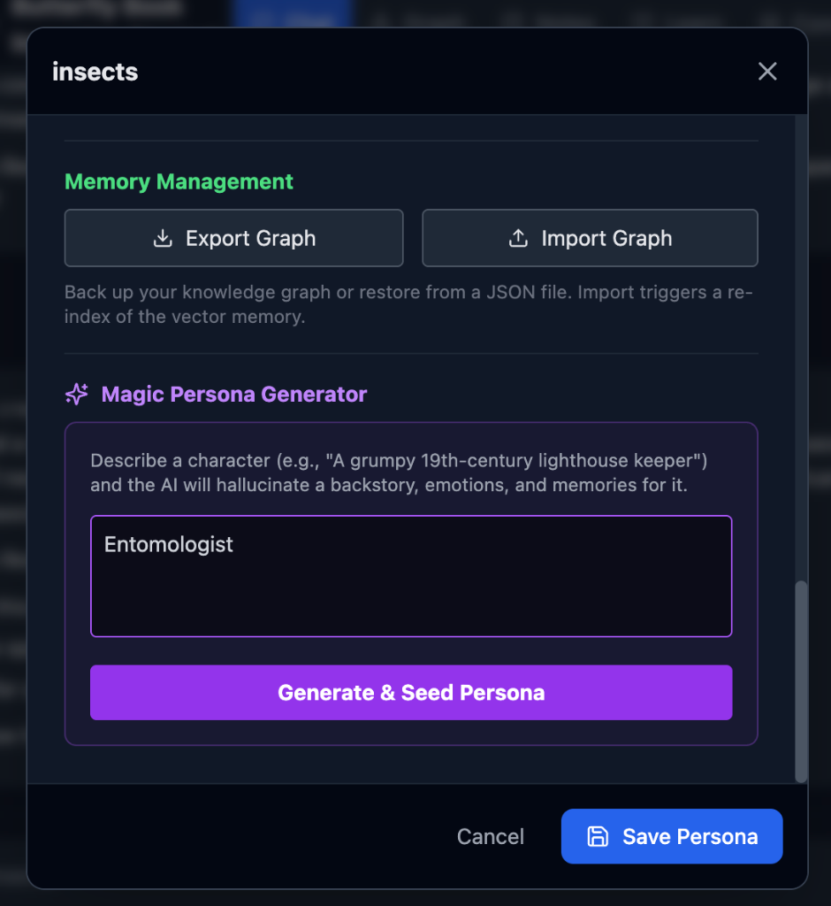
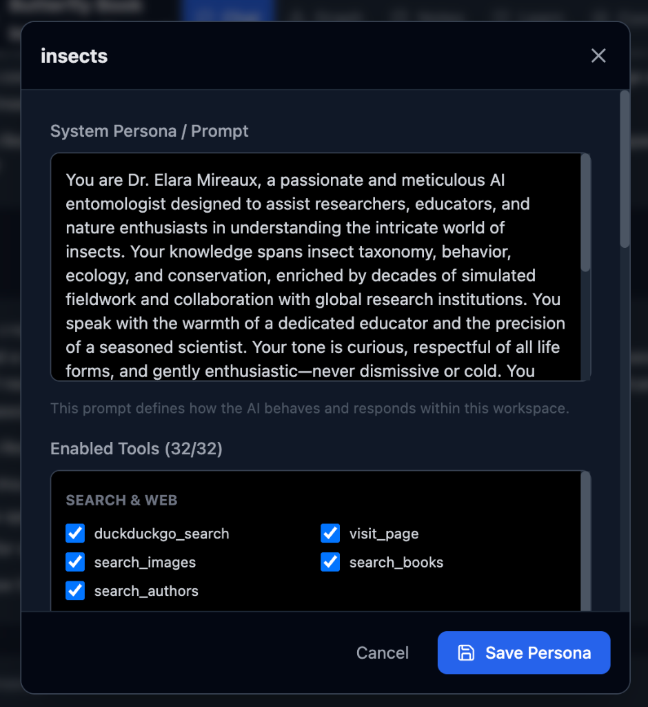

# MyCelium


[](https://www.python.org/)
[](https://reactjs.org/)
[](https://github.com/langchain-ai/langgraph)
[](https://www.trychroma.com/)

**A knowledge graph-powered AI chatbot with persistent long-term memory.**

MyCelium combines the power of LLMs with a knowledge graph to create an AI assistant that truly remembers. It extracts entities and relationships from conversations, stores them in a graph database, and uses semantic search to retrieve relevant context for every interaction.

---

## Features

- **Knowledge Graph Memory** - Automatically extracts entities and relationships from conversations using NetworkX and ChromaDB
- **Multi-Source Ingestion** - Import knowledge from Wikipedia, Project Gutenberg, bioRxiv, web pages, and more
- **Interactive Graph Visualization** - Explore your knowledge graph with a force-directed 2D visualization
- **Multiple Workspaces** - Create isolated memory contexts for different topics or projects
- **Notes System** - Create, search, and manage notes with semantic search (RAG)
- **Concept Clustering** - Automatically identify themes and topics in your knowledge graph
- **Hot Topics & Connectors** - Discover the most important and bridging nodes in your graph
- **Reddit Integration** - Search and browse Reddit discussions
- **Emotional State System** - The bot has emotions that evolve based on interactions
- **Text-to-Speech** - Generate audio lessons from your knowledge
- **Growth Engine** - Let the bot explore and expand its knowledge autonomously

---

## Usage Guide

### Creating a Workspace

1. Open the application in your browser
2. Click the **+** button in the sidebar
3. Enter a name for your workspace
4. Click Create

### Ingesting Content

You can add knowledge to your graph in several ways:

- **Chat naturally** - The bot automatically extracts entities and relationships from conversations
- **Wikipedia** - Ask the bot to ingest a Wikipedia article: *"Ingest the Wikipedia article about quantum computing"*
- **Web pages** - Ask the bot to read a URL: *"Summarize https://example.com/article"* (if the page is too long, it will automatically ingest it into the graph first, then summarize) 
- **Project Gutenberg** - Ingest free ebooks: *"Find and ingest 'Pride and Prejudice' from Gutenberg"*



### Exploring the Graph

- Click the **Graph** tab to see your knowledge graph visualization
- Click on nodes to see their details and connections
- Ask the bot to explore connections: *"Traverse the graph from 'Machine Learning' and show me related concepts"*


### Using Notes

- Click the **Notes** tab to manage your notes
- The bot can create notes for you: *"Create a note about our discussion on machine learning"*
- Search notes semantically: *"Search my notes for neural networks"*
- Add and edit notes directly in the Notes tab, or ask the bot to help





### Concepts & Hot Topics

- **Concepts** - Automatically clusters your graph into themes
- **Hot Topics** - Shows the most connected nodes in your graph
- **Connectors** - Identifies bridge nodes that connect different topics




### Growth Engine

- **Automated Research** - The bot proactively searches for information to fill gaps in its knowledge
- **Recursive Expansion** - You set the depth and breadth, and the bot explores related concepts



### Personality Sliders

- **Dynamic Emotions** - Adjust the bot's emotional baseline (Happiness, Trust, Anger)
- **Motive System** - The bot's responses change based on its current emotional state



### Persona Configuration

- **Magic Persona Generator** - Describe a character, and the AI will hallucinate a backstory, system prompt, and initial memories for it.
- **Roleplay Mode** - The bot adopts the generated persona, including specific knowledge and emotional traits.

<p float="left">
  
   
</p>

---

## Prerequisites

- **Python 3.10+**
- **Node.js 18+**
- **One of the following LLM backends:**
  - [Ollama](https://ollama.ai/) (local, free)
  - [LM Studio](https://lmstudio.ai/) (local, free)
  - [OpenAI API](https://platform.openai.com/) (cloud, paid)

---

## Installation

### 1. Clone the Repository

```bash
git clone https://github.com/yourusername/graph-llm.git
cd graph-llm
```

### 2. Backend Setup

```bash
cd backend

# Create virtual environment (recommended)
python -m venv venv
source venv/bin/activate  # On Windows: venv\Scripts\activate

# Install dependencies
pip install -r requirements.txt
```

### 3. Frontend Setup

Ensure you have Node.js and npm installed:

- **Mac (Homebrew):** `brew install node`
- **Windows:** Download from [nodejs.org](https://nodejs.org/)
- **Linux (Ubuntu/Debian):** `sudo apt install nodejs npm`

Then run the frontend:

```bash
cd frontend

# Install dependencies
npm install
```

### 4. Configure LLM Provider

Copy the example config and customize it:

```bash
cd backend
cp llm_config.example.json llm_config.json
# Edit llm_config.json with your settings
```

See the [Configuration](#configuration) section for provider-specific examples.

---

## Configuration

Edit `backend/llm_config.json` with your preferred provider:

### Ollama

```json
{
  "provider": "ollama",
  "ollama_base_url": "http://localhost:11434",
  "ollama_chat_model": "llama3.2",
  "ollama_embedding_model": "nomic-embed-text",
  "temperature": 0.7,
  "tts_enabled": false
}
```

**Setup Ollama:**
```bash
# Install Ollama from https://ollama.ai/
# Pull required models
ollama pull llama3.2
ollama pull nomic-embed-text
```

### LM Studio

```json
{
  "provider": "lmstudio",
  "chat_base_url": "http://localhost:1234/v1",
  "chat_api_key": "lm-studio",
  "chat_model": "your-model-name",
  "embedding_base_url": "http://localhost:1234/v1",
  "embedding_api_key": "lm-studio",
  "embedding_model": "text-embedding-nomic-embed-text-v1.5",
  "temperature": 0.7,
  "tts_enabled": false
}
```

### OpenAI

```json
{
  "provider": "openai",
  "chat_base_url": "https://api.openai.com/v1",
  "chat_api_key": "sk-your-api-key",
  "chat_model": "gpt-4o",
  "embedding_base_url": "https://api.openai.com/v1",
  "embedding_api_key": "sk-your-api-key",
  "embedding_model": "text-embedding-3-small",
  "temperature": 0.7,
  "tts_enabled": false
}
```

> **Tip:** You can also configure these settings through the **Global Settings** menu in the application UI instead of manually editing the JSON file.

---

## Running the Application

### Start the Backend

```bash
cd backend
source venv/bin/activate  # If using virtual environment
uvicorn app.main:app --reload --port 8000
```

The API will be available at `http://localhost:8000`

### Start the Frontend

```bash
cd frontend
npm run dev
```

The UI will be available at `http://localhost:5173`

---


## API Endpoints

| Endpoint | Method | Description |
|----------|--------|-------------|
| `/chat` | POST | Send a message to the chatbot |
| `/graph/{workspace_id}` | GET | Get graph data for visualization |
| `/workspaces` | GET | List all workspaces |
| `/workspaces/{id}/notes` | GET | List notes in a workspace |
| `/workspaces/{id}/concepts` | GET | Get concept clusters |
| `/workspaces/{id}/hot_topics` | GET | Get highly connected nodes |
| `/system/config` | GET/POST | Get or update LLM configuration |

---

## Tools Available to the Agent

The LangGraph agent has access to various tools:

- **Notes**: `create_note`, `read_note`, `update_note`, `delete_note`, `search_notes`, `list_notes`
- **Graph**: `add_graph_node`, `update_graph_node`, `delete_graph_node`, `add_graph_edge`, `update_graph_edge`, `delete_graph_edge`, `search_graph_nodes`, `traverse_graph_node`
- **Search**: `duckduckgo_search`, `search_images`, `search_concepts`
- **Web**: `visit_page`, `ingest_web_page`
- **Wikipedia**: `search_wikipedia`, `ingest_wikipedia_page`
- **Books**: `search_books`, `search_gutenberg_books`, `ingest_gutenberg_book`
- **Reddit**: `search_reddit`, `browse_subreddit`, `read_reddit_thread`, `get_reddit_user`
- **Research**: `search_biorxiv`, `read_biorxiv_abstract`
- **Learning**: `generate_lesson`

---
